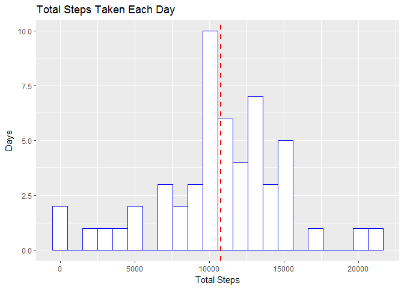
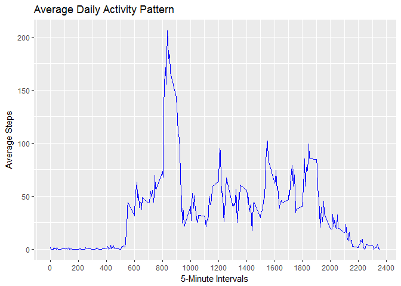
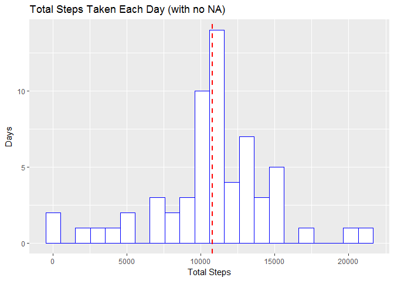
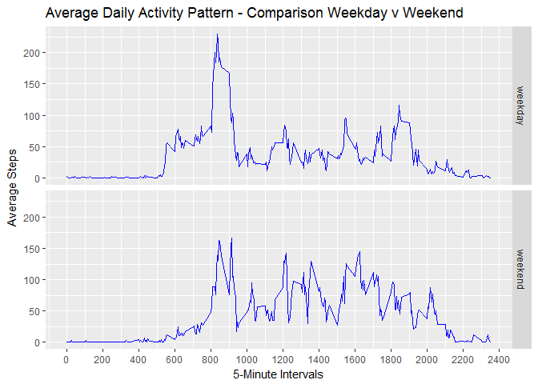

## Activity Monitoring Data

Data from a personal activity monitoring device has been collected over a two month period from an anonyous individual during the months of October and November 2012. It includes the number of steps taken in 5 minute intervals each day.

**Dataset:** [Activity monitoring data](https://d396qusza40orc.cloudfront.net/repdata%2Fdata%2Factivity.zip) [52k]

### Variables
- **steps:** Number of steps taking in a 5-minute interval (missing values are coded as NA
- **date:** The date on which the measurement was taken in YYYY-MM-DD format
- **interval:** Identifier for the 5-minute interval in which measurement was taken  
  
---
  
## Loading and Preprocessing the Data


```r
knitr::opts_chunk$set(echo = TRUE)
library(dplyr)
```

```
## 
## Attaching package: 'dplyr'
```

```
## The following objects are masked from 'package:stats':
## 
##     filter, lag
```

```
## The following objects are masked from 'package:base':
## 
##     intersect, setdiff, setequal, union
```

```r
library(ggplot2)

df <- read.csv("~/R/Coursera/Course 5/data/activity.csv")
df <- tbl_df(df)

df_date <- df %>% filter(!is.na(steps)) %>% group_by(date) %>%
            summarize(total.steps = sum(steps),                       mean.steps = mean(steps))

df_int <- df %>% filter(!is.na(steps)) %>% group_by(interval) %>%
            summarize(total.steps = sum(steps), mean.steps=mean(steps))
```
  
---  
  
## What is Mean Total number of Steps Taken Per Day?


```r
mean_steps <- as.integer(mean(df_date$total.steps))
median_steps <- median(df_date$total.steps)

ggplot(df_date, aes(x=total.steps)) + 
  geom_histogram(bins=22, colour="blue", fill="white") + 
  geom_vline(aes(xintercept=mean(total.steps, na.rm=T)), color="red", linetype="dashed", size=1) + 
  xlab("Total Steps") + ylab("Days") + 
  ggtitle("Total Steps Taken Each Day")
```

<!-- -->
  
The mean and median total number of steps taken each day are:  
**Mean = 10766**  
**Median = 10765**
  
---  
  
## What is the Average Daily Activity Pattern?


```r
max_int <- df_int[which.max(df_int$mean.steps),1]

ggplot(data=df_int, aes(x=interval, y=mean.steps)) + 
  geom_line(colour="blue") +
  scale_x_continuous(breaks=seq(0,2400,200)) +
  xlab("5-Minute Intervals") + ylab("Average Steps") +
  ggtitle("Average Daily Activity Pattern")
```

<!-- -->
  
The 5-minute interval which contains the maximum number of average steps is **835**   
  
---
  
## Imputing missing values


```r
total_na <- sum(is.na(df$steps)==TRUE)

df2 <- df 
k <- 0
for (j in 1:61) {
  for (i in 1:288) {
    if (is.na(df2[i+k,1])==TRUE) { df2[i+k,1] <- df_int[i,3] }
  }
  k <- k + 288
}

df2_date <- df2 %>% group_by(date) %>%
            summarize(total.steps = sum(steps),                       mean.steps = mean(steps))
```
Total missing values: **2304**  

Create a new data set where missing values for steps will be replaced with the mean for that 5-minute interval from original data set  


```r
mean2_steps <- as.integer(mean(df2_date$total.steps))
median2_steps <- as.integer(median(df2_date$total.steps))

ggplot(df2_date, aes(x=total.steps)) + 
  geom_histogram(bins=22, colour="blue", fill="white") + 
  geom_vline(aes(xintercept=mean(total.steps, na.rm=T)), color="red", linetype="dashed", size=1) + 
  xlab("Total Steps") + ylab("Days") + 
  ggtitle("Total Steps Taken Each Day (with no NA)")
```

<!-- -->
  
The mean and median total number of steps taken each day (with NA replaced with mean for each interval) are:  
**Mean = 10766**  
**Median = 10766**  

### Observations from Imputing Missing Values
By replacing missing values for steps with the mean for that 5-minute interval, this has increased the number of days with total steps equal to mean steps per day.  
  
---
  
## Are there Differences in Activity Patterns between Weekdays and Weekends?


```r
df_days <- df2 %>% 
            mutate(day = weekdays(as.Date(df$date)))

for (i in 1:length(df_days$day)) {
  if (df_days$day[i] == "Saturday" | df_days$day[i] == "Sunday") {
    df_days$wday[i] <- "weekend" 
  } else { 
    df_days$wday[i] <- "weekday"
  }
}
```

```
## Warning: Unknown or uninitialised column: 'wday'.
```

```r
df_days_int <- df_days %>%
            group_by(wday, interval) %>%
            summarize(total.steps = sum(steps), mean.steps=mean(steps))

ggplot(data=df_days_int, aes(x=interval, y=mean.steps)) + 
  facet_grid(wday ~.) +
  geom_line(colour="blue") + 
  scale_x_continuous(breaks=seq(0,2400,200)) +
  xlab("5-Minute Intervals") + ylab("Average Steps") +
  ggtitle("Average Daily Activity Pattern - Comparison Weekday v Weekend")
```

<!-- -->

### Observations of Average Daily Activity Pattern
There is a bigger peak in average steps between 0800 and 0930 on weekdays that weekends. Average steps also increase earlier (0530) on weekdays than on weekends (0700). Average steps appear to be more evenly spread between 0800 and 1800 on weekends.  
